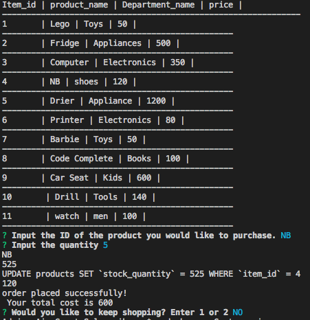

# Great-Sale

**The app displays the list of items for sale .
It prompts the user to input the id number for the item to purchase.
After the user inputs the amount, the app calculates the total cost and updates the database.
If there's no enough amount items for purchase, the order doesn't go through.**

